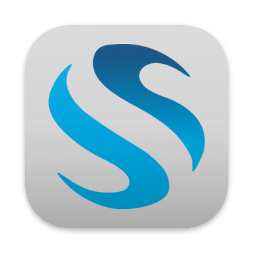
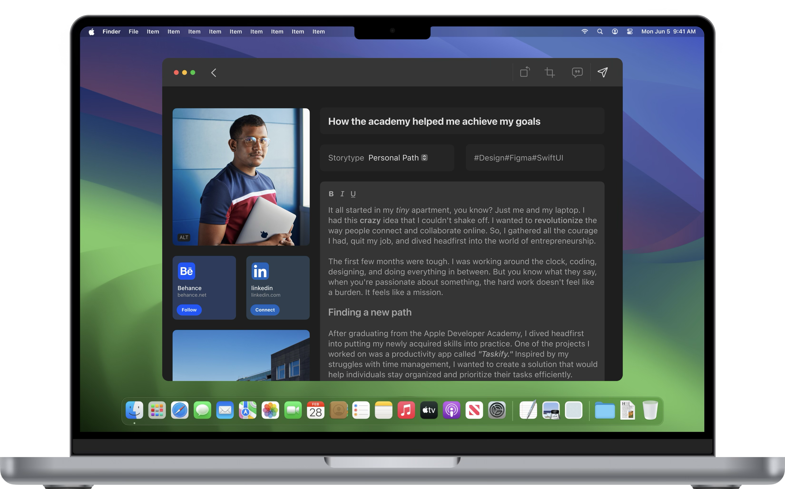
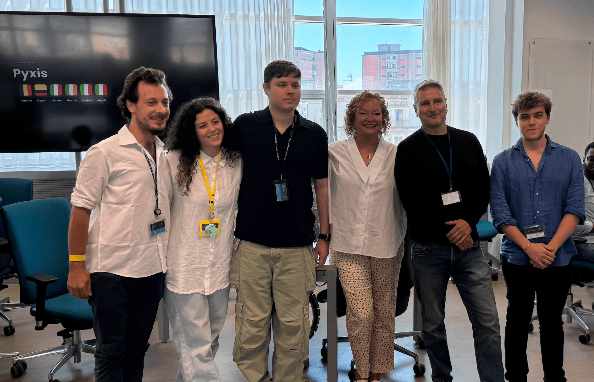

# Seven Seas Introduction

Introduction to the Seven Seas app that I worked on at the Apple Developer Academy. 

> [!NOTE]
> There is no code published here as I do not have ownership of the codebase. 

**The Pier Program**

The Pier Program is a graduate year at the Academy where a few outstanding students are selected to work on new or existing projects for internal or external clients. It is more like work experience, as we use Agile methodologies and must regularly meet with our client to showcase out work and confirm we are meeting their needs. 

**Starting the Pier Program**

When we were first assigned to the Seven Seas project, we were a bit lost. We were given vague direction to create an app that enables Academy alumni to connect and share their stories. The name Seven Seas is to represent the fact that after graduating, students will be scattered all across the world. 

**Pyxis**

Our team was made up of three designers (Angelo, Serena and Miguel) and three coders (Adriano, Jacques and myself). Our task was to guide them so we chose the team name of Pyxis, the constellation of the compass. 

**Our Solution**

We decided to create an app for the alumni of all the Academies around the world to share their stories with each other. After starting out with several designs and an extensive round of A/B testing, we had our basic design. Then it was time for our coders to get to work... 

We created a macOS app using SwiftUI for the frontend, and a FileMaker server for the backend. Due to the versatility of SwiftUI, we were also able to extend our goals and create an iPadOS app as well with minimal changes. 

**The Future**

The Seven Seas project has now graduated the Pier Program. It has been transferred to the Alumni board, who will guide its development in the future. 

We are very proud of what we accomplished over just nine short months. We even had an opportunity to showcase our MVP to Lisa Jackson from Apple. We look forward to using the app ourselves on its release! 

